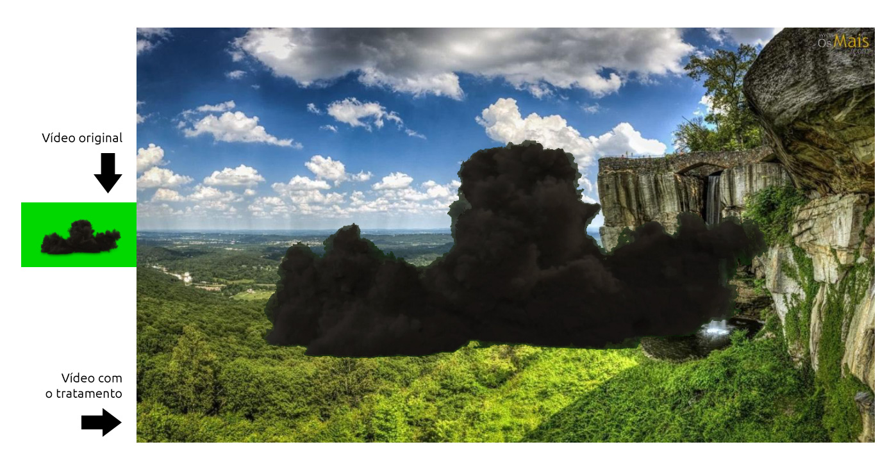

# Chroma key com Javascript/HTML

## Funcionamento
Para a retirada da cor chave do vídeo, é necessario espelhar a imagem do vídeo em um objeto canvas, nele, fazemos a manipulação de cor.

Para o espelhamento, precisamos de 2 elemetos no DOM:
- vídeo
- canvas

o elemento vídeo rodará escondido, e executará o áudio.
o elemento canvas será o espelho da imagem do vídeo, com o tratamento no chromakey.

A partir de um evento de vídeo carregado, executamos um loop de 40ms (equivalente a 25fps) que fará uma captura e tratamento da imagem do vídeo no momento atual. O tratamento consiste em verificar a intesidade de cada cor, em cada pixel da imagem, se estiver dentro da regra programada, mexemos no canal alpha do pixel.

## Pré requisito
Para o funcionamento ideal:
- Javascript puro
- Vídeo/Mídia
- Imagem de fundo